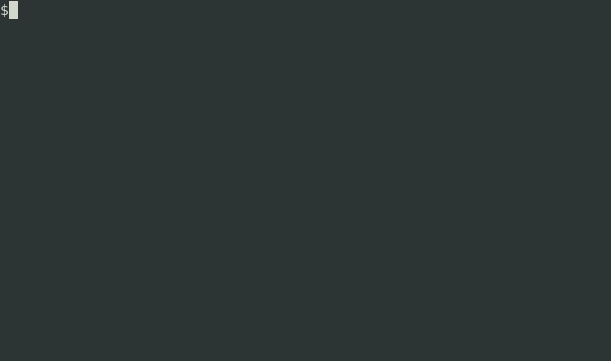

# flashcards

Application for creating and studying flashcards on the command line. Forked from [zergov/flashcards](https://github.com/zergov/flashcards).



## Installation

Use [pipx](https://github.com/pipxproject/pipx):

```
$ pipx install git+https://github.com/kdwarn/flashcards.git
```

## Creating a Deck and Adding Cards

The app stores flashcards in decks. To create a deck, run `flashcards create`. You will then be prompted to provide a name and a description of the deck.

To then add a card to the deck, run `flashcards add` and you will be prompted to provide a question and answer for the card.

You can also write the question and answer inside an editor by passing the `-e` parameter to the `flashcards add` command: `flashcards add -e`. This will open vim by default or the editor set to your `EDITOR` environment variable.

Add as many cards as you like.

## The Selected Deck and Deck Status

By default, after creating a deck, the application automatically selects it. New cards you create will be added to this deck (until you select a different one). Also, the `flashcards status` command will show information on the currently selected deck:

```
$ flashcards status

Currently selected deck: Math
Number of cards: 1
Description: Some math questions
```

To select a different deck:

```
$ flashcards select French

Selected deck: French
New cards will be added to this deck.
```

## Studying Decks, Editing Cards

You can study the currently selected deck with `flashcards study` or you can specify a different deck, e.g. `flashcards study German`. If you have more than one deck, you can also study them all at once with `flashcards study all`.

The app will iterate through the cards, pausing between the question and answer. After the answer is displayed, you can edit the card by pressing "e" and quit the session by pressing "q".

By default, the cards will be shuffled before you start studying. To display them in the order they were created in, pass the `--ordered` flag: `flashcards study German --ordered`.

## Storage directory

By default, decks are stored at `~/.flashcards`, in json format.

